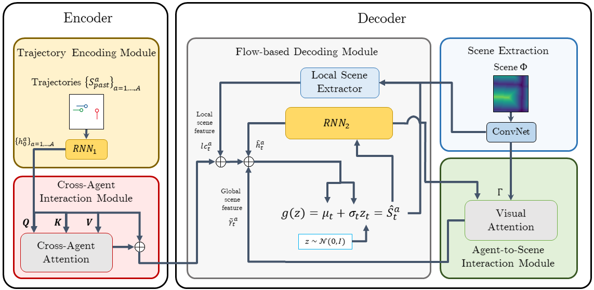

# Diverse and Admissible Trajectory Forecasting through Multimodal Context Understanding

This code is PyTorch implementation of [Diverse and Admissible Trajectory Forecasting through Multimodal Context Understanding](https://arxiv.org/abs/2003.03212).



## Requirements
Python 3 and the following external packages.
- PyTorch>=1.7
- torchvision
- scipy
- numpy
- openCV
- [Argoverse API](https://github.com/argoai/argoverse-api)
- [nuScenes API](https://github.com/nutonomy/nuscenes-devkit)

## Downloading Dataset

You will have to download [Argoverse](https://www.argoverse.org/data.html#download-link) and [nuScenes](https://www.nuscenes.org/download) dataset into **data/Argoverse** and  **data/nuScenes**, then verify the subdirectory of each dataset. Dataset should have structure same as:

```
-Argoverse
  |- test_obs/data/*.csv
  |- train/data/*.csv
  |- val/data/*.csv

-nuScenes
  |- sweeps/"Sensor Name (e.g., LIDAR_TOP)"/*
  |- trainval_meta
      |- maps/*.json
      |- v1.0-trainval/*.json
```


## Preprocessing Dataset

Both Argoverse and nuScenes dataset have to be preprocessed prior to testing this model. To do so, you may simply run python scripts **preprocess_argoverse.py** and **preprocess_nuscenes.py**. Each script will generate distance transform of drivable area map and partition **train, train_val,** and **val** (plus, **test_obs** for Argoverse) splits for training. Note that these names do not represent ***train/validation/test sets*** regime in general machine learning literature. Instead, they are derived from the naming done by authors for each dataset. In this model, overall, **train split** corresponds to  ***train set***, **train_val split** corresponds to ***validation set***, and **val split** corresponds to ***test set***. The scripts will additionally generate symlinks to form **train_all split**, which is the union of **train split** and **train_val split** to be used for finetuning this model.

In **preprocess_nuscenes.py**, Kalman smoothing with constant velocity model will be performed to generate trajectories from tracklets since the original nuScenes dataset is not geared to trajectories task (UPDATE: nuScenes now has the [*prediction* task](https://www.nuscenes.org/prediction) open).

The preprocessed datasets will be saved at **data/Preprocessed/**.


## Initial Training
This model is initially trained using **train** with learning rate decay on plateau depending on performances measured using **train_val**. See comments and values in main.py for the hyperparameter details. To train the proposed method under a minimal set of options, run the following commands.

**nuScenes**
```
python main.py --model_type=AttGlobal_Scene_CAM_NFDecoder --dataset=nuscenes \
--train_partition=train --train_cache=./train.nusc.pkl \
--val_partition=train_val --val_cache=./train_val.nusc.pkl \
--tag=attgscam.nusc --batch_size=8 
```
**Argoverse**
```
python main.py --model_type=AttGlobal_Scene_CAM_NFDecoder --dataset=argoverse \
--train_partition=train --train_cache=./train.argo.pkl \
--val_partition=train_val --val_cache=./train_val.argo.pkl \
--tag=attgscam.argo --batch_size=8 
```

## Fine-tuning
After the initial training is done either due to reaching the maximum set epochs or the maximum set learning rate decays, one must perform finetuning to achieve the best performance in testing time. To do so, set the training split to ***train_all*** and provide the location of the initial training log and the restoring epoch to arguments *--restore_path* and *--restore_epoch*. In addition, set a small learning rate value (e.g., 1e-5) which should be much smaller than that used during the initial training.

To fine-tune the proposed method under a minimal set of options, run the following commands.

**nuScenes**
```
python main.py --model_type=AttGlobal_Scene_CAM_NFDecoder --dataset=nuscenes \
--train_partition=train_all --train_cache=./train_all.nusc.pkl \
--val_partition=val --val_cache=./val.nusc.pkl \
--tag=attgscam.finetune.nusc --batch_size=8 --init_lr=1e-5 \
--restore_path=./experiment/attgscam.nusc --restore_epoch=50
```

**Argoverse**
```
python main.py --model_type=AttGlobal_Scene_CAM_NFDecoder --dataset=argoverse \
--train_partition=train_all --train_cache=./train_all.argo.pkl \
--val_partition=val --val_cache=./val.argo.pkl \
--tag=attgscam.finetune.argo --batch_size=8 --init_lr=1e-5 \
--restore_path=./experiment/attgscam.argo --restore_epoch=50
```

## Testing

Testing will be used by assigning checkpoint to argument *--test_ckpt*.

**nuScenes**
```
python main.py --model_type=AttGlobal_Scene_CAM_NFDecoder --dataset=nuscenes \
--test_partition=val --test_cache=./val.nusc.pkl \
--tag=attgscam.finetune.nusc --batch_size=8 \
--test_ckpt=./experiment/attgscam.finetune.nusc*/*.pth.tar
```

**Argoverse**
```
python main.py --model_type=AttGlobal_Scene_CAM_NFDecoder --dataset=argoverse \
--train_partition=train_all --train_cache=./train_all.argo.pkl \
--test_partition=val --test_cache=./val.argo.pkl \
--tag=attgscam.finetune.argo --batch_size=8 \
--test_ckpt=./experiment/attgscam.finetune.argo*/*.pth.tar
```

## Things to do

- [x] Re-implement preprocess_argoverse.py and preprocess_nuscenes.py.
- [] Reorganize implementations for MATF/R2P2/Desire/CSP/SimpleEncoderDecoder
- [] Reorganize comments for model definition and miscellaneous scripts.
- [] Note hyperparameters for training/fine-tuning at README.md.

## Citation
Please cite the original publication;
```
@inproceedings{park2020diverse,
  title={Diverse and admissible trajectory forecasting through multimodal context understanding},
  author={Park, Seong Hyeon and Lee, Gyubok and Seo, Jimin and Bhat, Manoj and Kang, Minseok and Francis, Jonathan and Jadhav, Ashwin and Liang, Paul Pu and Morency, Louis-Philippe},
  booktitle={European Conference on Computer Vision},
  pages={282--298},
  year={2020},
  organization={Springer}
}
```


## License

This code is published under the [General Public License version 2.0](LICENSE).
