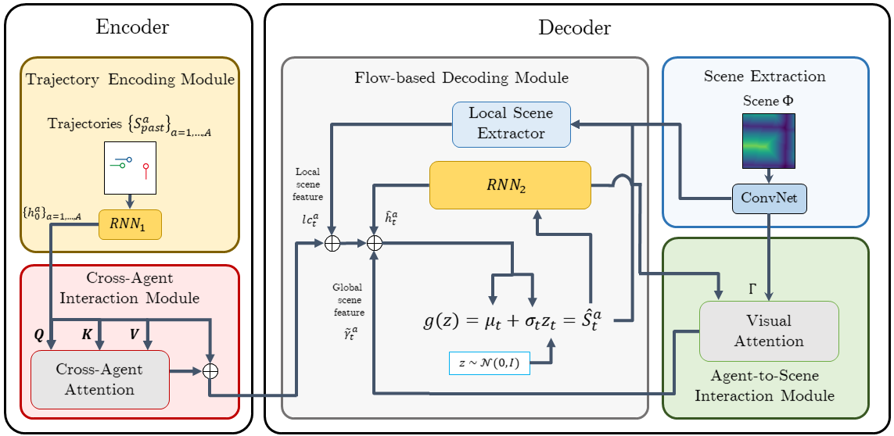

# Diverse and Admissible Trajectory Forecasting through Multimodal Context Understanding

This code is PyTorch implementation of our work, [Diverse and Admissible Trajectory Forecasting through Multimodal Context Understanding](https://arxiv.org/abs/2003.03212) (Seong Hyeon Park, Gyubok Lee, Manoj Bhat, Jimin Seo, Minseok Kang, Jonathan Francis, Ashwin R. Jadhav, Paul Pu Liang and Louis-Philippe Morency). 



Trajectory forecasting task was implemented using normalizing-flow, and achieving diverse while admissible trajectorys for vehicles.

## Dataset

You will have to download dataset into **data/[corresponding dataset]**, then verify the subdirectory of each dataset. Dataset should have structure same as:

```
-[dataset]
  |- 
```

Dataset will be extracted as cache at the initial execution. When not specified, cache file will be used for preceeding experiments. 

## Training

See details on *train.py*

To train proposed method;
```
python setup.py develop && CUDA_VISIBLE_DEVICES=2 python train.py --config=config_atgs_cam_nf
```


## Testing

Testing will be used by assigning checkpoint to argument *--test_ckpt*;
Make sure to change the TRAIN flag on the config file to false 
```
python setup.py develop && CUDA_VISIBLE_DEVICES=2 python test.py --config=config_atgs_cam_nf --test_ckpt="xyz.tar"
```

## Things to do

- [x] ~~Select appropriate License; currently we used GPLv3.~~
- [ ] MATF_GAN had runtime error which has fixed. For coherence, this will be updated after recieving it.
- [ ] Check the *requirements*


## Citation
Please cite the original publication;

```
@article{park2020diverse,
  title={Diverse and Admissible Trajectory Forecasting through Multimodal Context Understanding},
  author={Park, Seong Hyeon and Lee, Gyubok and Bhat, Manoj and Seo, Jimin and Kang, Minseok and Francis, Jonathan and Jadhav, Ashwin R and Liang, Paul Pu and Morency, Louis-Philippe},
  journal={arXiv preprint arXiv:2003.03212},
  year={2020}
}
```


## License

This code is published under the [General Public License version 3.0](LICENSE).
